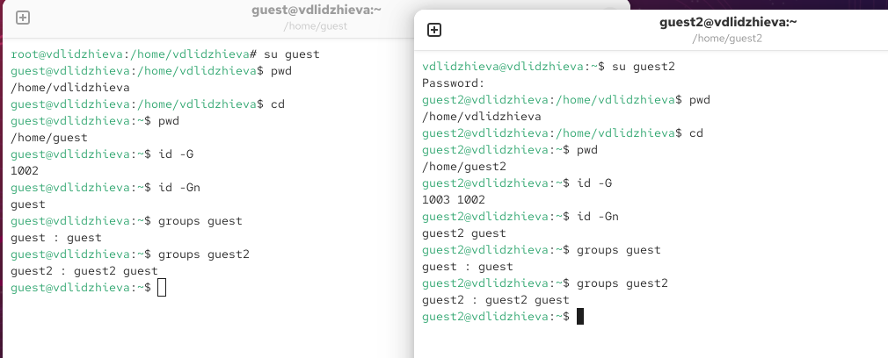
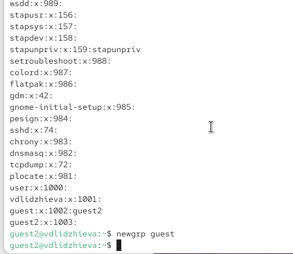
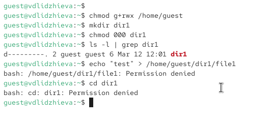
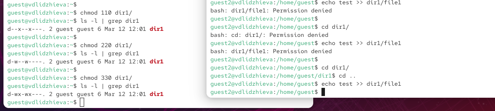
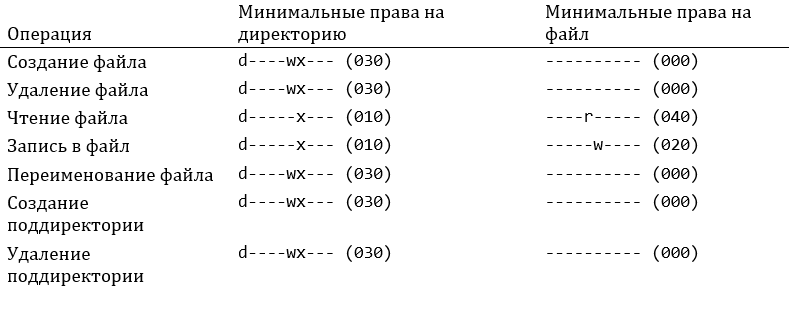

---
## Author
author:
  name: Валерия Лиджиева
  email: 1132247516@rudn.ru
  affiliation:
    - name: Российский университет дружбы народов
      country: Российская Федерация
      postal-code: 117198
      city: Москва
      address: ул. Миклухо-Маклая, д. 6
	  
## Title
title: "Доклад по лабораторной работе №3"
subtitle: "Дискреционное разграничение прав в Linux. Основные атрибуты"
license: CC BY
date: today
date-format: "YYYY-MM-DD"
---

# Цели и задачи работы

## Цель лабораторной работы

Получение практических навыков работы в консоли с атрибутами файлов для групп пользователей.

# Процесс выполнения лабораторной работы

## Определяем UID и группу двух пользователей

{ #fig:001 width=70% height=70% }

## Файл с данными о пользователях

{ #fig:002 width=70% height=70% }

## Атрибуты директории

{ #fig:003 width=70% height=70%}

## Заполнение таблицы

{ #fig:004 width=70% height=70% }

## Права и разрешённые действия

{ #fig:005 width=70% height=70% }

# Выводы по проделанной работе

## Вывод

В ходе выполнения работы, мы смогли приобрести практические навыки работы в консоли с атрибутами файлов для групп пользователей.