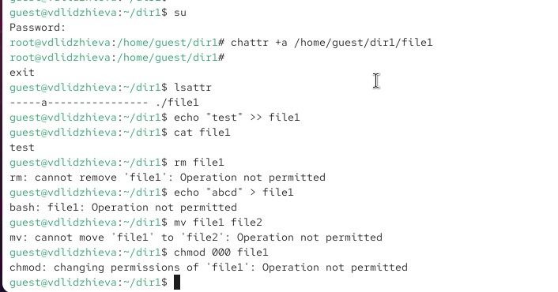
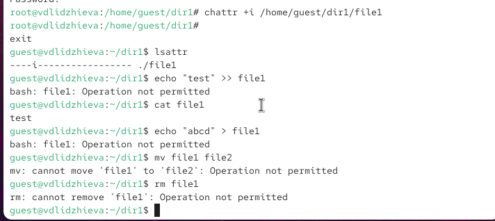

---
## Author
author:
  name: Валерия Лиджиева
  email: 1132247516@rudn.ru
  affiliation:
    - name: Российский университет дружбы народов
      country: Российская Федерация
      postal-code: 117198
      city: Москва
      address: ул. Миклухо-Маклая, д. 6
	  
## Title
title: "Доклад по лабораторной работе №4"
subtitle: "Дискреционное разграничение прав в Linux. Расширенные атрибуты"
license: CC BY
date: today
date-format: "YYYY-MM-DD"
---

# Цели и задачи работы

## Цель лабораторной работы

Получение практических навыков работы в консоли с расширенными атрибутами файлов.

# Процесс выполнения лабораторной работы

## Теоретическое введение 

Помимо прав доступа каждый из файлов стандартной файловой системы Linux имеет набор атрибутов, регламентирующих особенности работы с ним. Chattr - это команда в Linux, 
которая позволяет пользователю устанавливать и снимать определенные атрибуты файла. Доступны следующие атрибуты: a, A, c, C, D, e, i, j, s, S, t, u.

## Расширенный атрибут а

{ #fig:001 }

## Расширенный атрибут i

{ #fig:002 }

## Вывод

Получены практические навыки работы в консоли с расширенными атрибутами файлов. 
