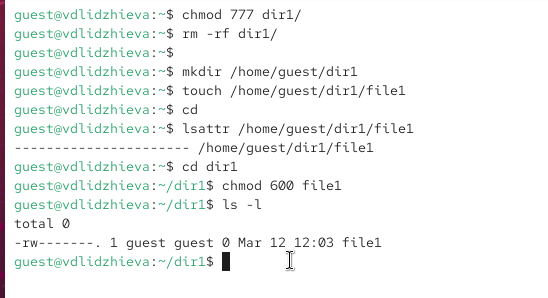
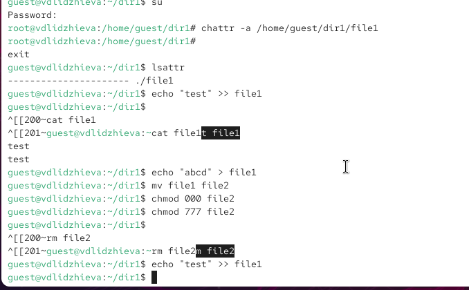

---
## Author
author:
  name: Валерия Лиджиева
  email: 1132247516@rudn.ru
  affiliation:
    - name: Российский университет дружбы народов
      country: Российская Федерация
      postal-code: 117198
      city: Москва
      address: ул. Миклухо-Маклая, д. 6

## Title
title: "Отчёт по лабораторной работе №4"
subtitle: "Дискреционное разграничение прав в Linux. Расширенные атрибуты"
license: "CC BY"
---

# Цель работы

Получение практических навыков работы в консоли с расширенными атрибутами файлов.

# Выполнение лабораторной работы

1. От имени пользователя guest определите расширенные атрибуты файла /home/guest/dir1/file1 командой lsattr /home/guest/dir1/file1

2. Установите командой chmod 600 file1 на файл file1 права, разрешающие чтение и запись для владельца файла.

{ #fig:001 width=70% height=70%}

3. Попробуйте установить на файл /home/guest/dir1/file1 расширенный атрибут a от имени пользователя guest: chattr +a /home/guest/dir1/file1

Получаем отказ, для смены расширенных атрибутов недостаточно прав.

4. Зайдите на третью консоль с правами администратора либо повысьте свои права с помощью команды su. Попробуйте установить расширенный атрибут a на файл /home/guest/dir1/file1 от имени суперпользователя: chattr +a /home/guest/dir1/file1

Команда выполнилась от имени суперпользователя

5. От пользователя guest проверьте правильность установления атрибута: lsattr /home/guest/dir1/file1

Атрибут –а установлен.

6. Выполните дозапись в файл file1 слова «test» командой echo "test" >> /home/guest/dir1/file1

Дозапись выполнена.

После этого выполните чтение файла file1 командой cat /home/guest/dir1/file1 Файл содержит строку “test”.

7. Попробуйте удалить файл file1 либо стереть имеющуюся в нём информацию командой echo "abcd"  >  /home/guest/dirl/file1 Попробуйте переименовать файл.

Перезаписать файл не удается, удалить или переименовать тоже.

8. Попробуйте с помощью команды chmod 000 file1 установить на файл file1 права, например, запрещающие чтение и запись для владельца файла. Удалось ли вам успешно выполнить указанные команды?

Команда изменения прав также не выполняется.

{ #fig:002 width=70% height=70%}

9. Снимите расширенный атрибут a с файла /home/guest/dirl/file1 от имени суперпользователя командой chattr -a /home/guest/dir1/file1

Атрибут снят.

Повторите операции, которые вам ранее не удавалось выполнить. Ваши наблюдения занесите в отчёт.

После снятия атрибута –а стало возможным переписать файл, удалить или переименовать его, а также сменить права. Атрибут –а позволяет только дозаписывать файл.

{ #fig:003 width=70% height=70%}

10. Повторите ваши действия по шагам, заменив атрибут «a» атрибутом «i». Удалось ли вам дозаписать информацию в файл? Ваши наблюдения занесите в отчёт. 

Атрибут –i запрещает любое изменеие файла: дозапись, переименование, удаление, смену атрибутов.

{ #fig:004 width=70% height=70%}

# Выводы

Получены практические навыки работы в консоли с расширенными атрибутами файлов. 

# Список литературы{.unnumbered}

1. [КОМАНДА CHATTR В LINUX](https://losst.ru/neizmenyaemye-fajly-v-linux)
2. [chattr](https://en.wikipedia.org/wiki/Chattr)
