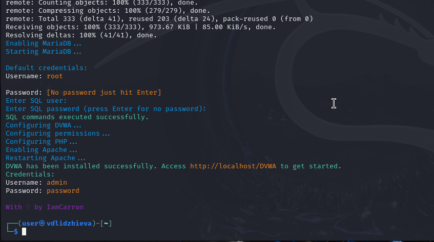

---
## Author
author:
  name: Валерия Лиджиева
  email: 1132247516@rudn.ru
  affiliation:
    - name: Российский университет дружбы народов
      country: Российская Федерация
      postal-code: 117198
      city: Москва
      address: ул. Миклухо-Маклая, д. 6
	  
## Title
title: "Доклад по этапу проекта №2"
license: CC BY
date: today
date-format: "YYYY-MM-DD"
---

# Цели и задачи работы

## Цель лабораторной работы

Целью данной работы является изучение задач приложения DVWA и его установка в систему Kali Linux.

# Процесс выполнения лабораторной работы

## Введение

**Damn Vulnerable Web Application** (DVWA) — это веб-приложение на PHP/MySQL, которое чертовски уязвимо. Его главная цель — помочь профессионалам по безопасности протестировать их навыки и инструменты в легальном окружении, помочь веб-разработчикам лучше понять процесс безопасности веб-приложений и помочь и студентам и учителям в изучении безопасности веб-приложений в контролируем окружении аудитории.

## Установка

{ #fig:001 width=70% height=70% }

## Установка

{ #fig:002 width=70% height=70% }

## Проверка

{ #fig:003 width=70% height=70% }

# Выводы по проделанной работе

## Вывод

Мы приобрели знания о приложении DVWA и установили его в ОС.