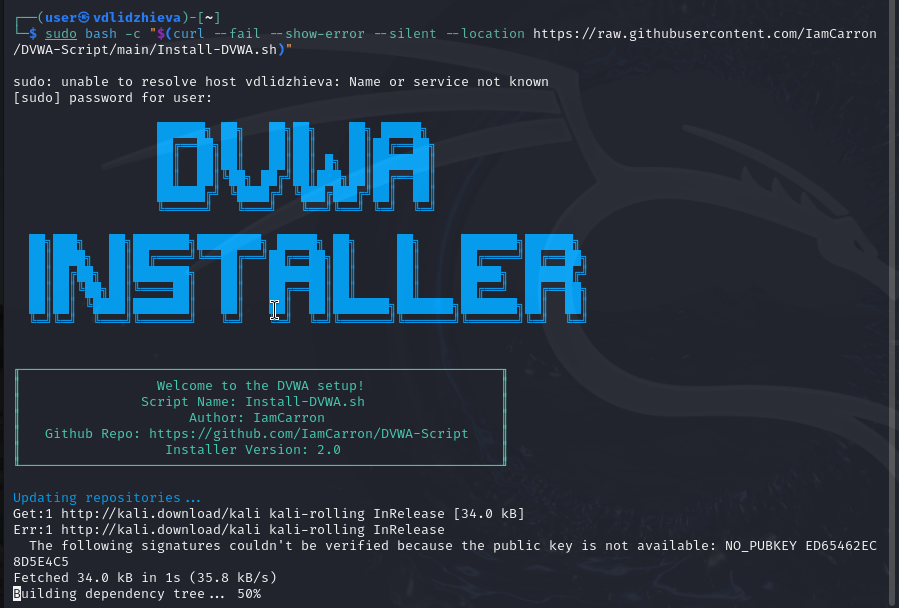
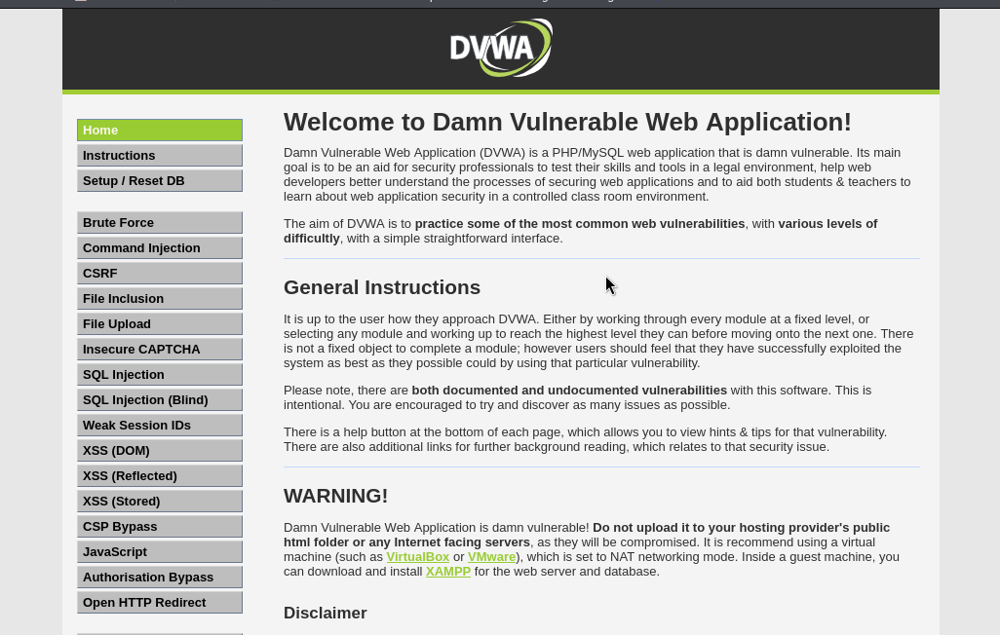

---
## Author
author:
  name: Валерия Лиджиева
  email: 1132247516@rudn.ru
  affiliation:
    - name: Российский университет дружбы народов
      country: Российская Федерация
      postal-code: 117198
      city: Москва
      address: ул. Миклухо-Маклая, д. 6

## Title
title: "Индивидуальный проект - этап 2"
subtitle: "Установка DVWA"
license: "CC BY"
---

# Цель работы

Целью данной работы является изучение задач приложения DVWA и его установка в систему Kali Linux.

# Введение

**Damn Vulnerable Web Application** (DVWA) — это веб-приложение на PHP/MySQL, которое чертовски уязвимо. Его главная цель — помочь профессионалам по безопасности протестировать их навыки и инструменты в легальном окружении, помочь веб-разработчикам лучше понять процесс безопасности веб-приложений и помочь и студентам и учителям в изучении безопасности веб-приложений в контролируем окружении аудитории.

Цель DVWA попрактиковаться в некоторых самых распространённых веб-уязвимостях, с различными уровнями сложности, с простым прямолинейном интерфейсом. Обратите внимание, что имеются как задокументированные, так и незадокументированные уязвимости в этом программном обеспечении. Это сделано специально. Вам предлагается попробовать и обнаружить так много уязвимостей, как сможете.

Некоторые из уязвимостей веб-приложений, который содержит DVWA;

* **Брут-форс**: Брут-форс HTTP формы страницы входа; используется для тестирования инструментов по атаке на пароль методом грубой силы и показывает небезопасность слабых паролей.

* **Исполнение** (внедрение) команд: Выполнение команд уровня операционной системы.

* **Межсайтовая подделка запроса (CSRF)**: Позволяет «атакующему» изменить пароль администратора приложений.

* **Внедрение (инклуд) файлов**: Позволяет «атакующему» присоединить удалённые/локальные файлы в веб-приложение.

* **SQL внедрение**: Позволяет «атакующему» внедрить SQL выражения в HTTP из поля ввода, DVWA включает слепое и основанное на ошибке SQL внедрение.

* **Небезопасная выгрузка файлов**: Позволяет «атакующему» выгрузить вредоносные файлы на веб-сервер.

* **Межсайтовый скриптинг (XSS)**: «Атакующий» может внедрить свои скрипты в веб-приложение/базу данных. DVWA включает отражённую и хранимую XSS.

* **Пасхальные яйца**: раскрытие полных путей, обход аутентификации и некоторые другие.

# Выполнение лабораторной работы

Для установки приложения на Debian системы можно воспользоваться командой в одну строку.

```bash

sudo bash -c "$(curl --fail --show-error --silent --location https://raw.githubusercontent.com/IamCarron/DVWA-Script/main/Install-DVWA.sh)"

```

Или же скопировать из репозитория установочный скрипт и запустить его.

Также существует полностью ручной способ установки, но рассматривать его мы не будем.

{ #fig:001 width=70% height=70% }

{ #fig:002 width=70% height=70% }

Далее DVWA работает как локальный сервер и доступно через браузер.

{ #fig:003 width=70% height=70% }

# Вывод

Мы приобрели знания о приложении DVWA и установили его в ОС.